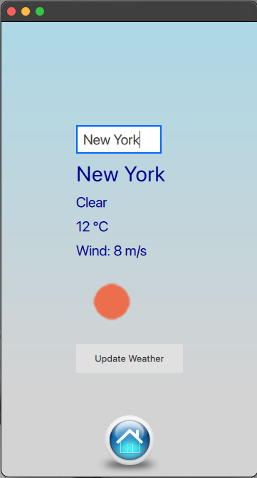
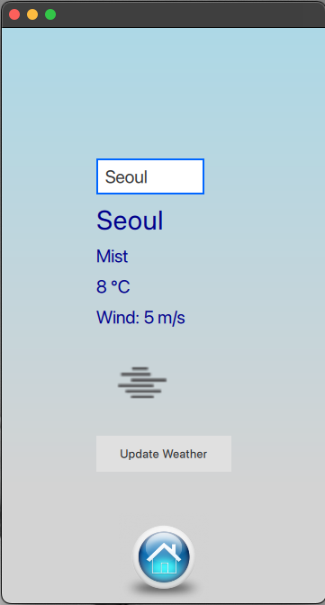

# Weather App

## Overview

This is a simple weather application built with QtQuick 6.5 and QtQuick Controls. It allows users to input a city name, fetch weather data from the OpenWeatherMap API, and display the current weather conditions.

## Features

- Input field to enter the city name.
- Display of the city name, weather description, temperature, and wind speed.
- Visual representation of weather conditions with an icon.
- Update button to refresh weather data.

## Setup and Usage

1. Make sure you have QtQuick 6.5 installed.

2.  Clone the repository to your local machine:

   ```bash
   git clone https://github.com/Razib91lightspeed/Qt_weatherApp.git
   ```


3. Go to the interview_challenge direcotry

   ```bash
   cd Qt_weatherApp
   ```
4. Open the project in Qt Creator or your preferred Qt development environment.

5. Run the application.


## Usage

1. Enter the city name in the provided text field.

2. Press Enter or click the "Update Weather" button to fetch and display the weather data.

3. The background gradient changes based on the main weather condition.

## API Key

Replace `YOUR_API_KEY` in the URL with your OpenWeatherMap API key.

## Dependencies

- QtQuick 6.5
- QtQuick Controls

## License

This project is licensed under the MIT License - see the [LICENSE](LICENSE) file for details.

## Acknowledgments

- Weather data provided by OpenWeatherMap.





# Author
- Razib Hasan
